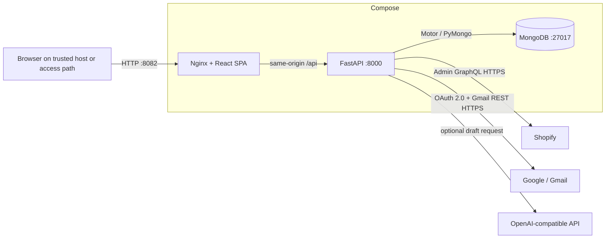

# Architecture

## Scope and Source of Truth

E-RYDEZ Operations Console is a local operations workspace with a **Shopify commerce read model** and a separate **Gmail workspace**. Shopify is the authoritative source for commerce entities. MongoDB stores complete normalized Shopify snapshots and serves the currently active snapshot to the console. Gmail is not copied into those snapshots; the Gmail workspace reads provider threads on demand through the Gmail REST API.

The application does not implement Shopify mutations, scheduled synchronization, provider webhooks, Gmail watches, background Gmail synchronization, attachment download, application login, authorization, tenant isolation, or TLS termination.

| Domain | System of record | Local representation | Console behavior |
|---|---|---|---|
| Orders, products, variants, inventory, customers, fulfillments, refunds, returns | Shopify Admin GraphQL | Normalized documents belonging to the active `sync_id` | Read-only query and aggregate views |
| Gmail threads and messages | Gmail REST API | No durable message mirror; only last on-demand refresh metadata | Read on demand; operator-confirmed thread replies |
| OAuth and integration control | Console/MongoDB | Encrypted Gmail refresh token, one-time OAuth state hashes, integration registry, health snapshots, audit events | Local operational metadata and OAuth lifecycle |

## Components and Boundaries

| Component | Responsibility | Depends on | Must not own |
|---|---|---|---|
| React SPA | Renders primary operations routes, global snapshot search, Settings, and Gmail workspace. | `frontend/src/lib/api.js`, SWR, React Router | Provider credentials, direct provider transport, canonical persistence |
| API client | Centralizes browser requests under `/api`; production uses same-origin requests. | Axios, `REACT_APP_BACKEND_URL` for separate development | Data normalization or provider-specific secrets |
| FastAPI service | Exposes health, snapshot, canonical-query, control-plane, and Gmail endpoints. Creates indexes and coordinates snapshot activation. | MongoDB, Shopify adapter, Gmail service | Frontend presentation or external schedule management |
| Shopify adapter | Loads configuration, obtains/reuses an access token, makes Admin GraphQL requests, retries/throttles, cursor-paginates, and normalizes snapshots. | Shopify Admin GraphQL | Persistent operational authority or browser behavior |
| Gmail service | Implements OAuth authorization-code flow, Fernet token encryption, Gmail reads, sanitized HTML, reply construction, and optional AI draft generation from a server-supplied minimized fact card. | Google OAuth/Gmail REST, MongoDB, optional OpenAI-compatible API | Background Gmail synchronization, automatic sending, Shopify lookup, or canonical persistence |
| MongoDB | Persists canonical snapshot collections, active metadata, sync history, integration control records, OAuth state, and encrypted refresh tokens. | Compose data network | Shopify authority or unauthenticated public access |
| Nginx | Serves the compiled SPA, exposes `/healthz`, proxies `/api/`, and falls back to `index.html` for SPA routing. | Internal backend service | Application authentication or TLS |

## Deployment Topology

Docker Compose is the supported deployment topology. The frontend is the only service with a host port, bound to `127.0.0.1:${ERYDEZ_PORT:-8082}`. Backend and MongoDB ports remain internal to Compose networks. The backend runs as a non-root user with a read-only filesystem and temporary `/tmp`; MongoDB uses a named volume.

This topology is **not a public-service architecture**. The repository does not provide TLS, application authentication, authorization, or tenant separation. Do not remove the loopback binding or place the console behind a public proxy without a separate, reviewed security design.

## Data Flow

### Shopify Snapshot Flow

1. An operator invokes `POST /api/shopify/sync` from the shell or Settings.
2. The server enforces a process-local single-run lock, creates a sync-run record, and delegates snapshot fetching to `backend/shopify.py`.
3. The adapter obtains a static Admin token or a client-credentials token, reads the shop profile and source counts, then cursor-paginates products, orders, customers, and inventory items. It derives variants from products and fulfillment, refund, and return records from orders.
4. The adapter normalizes records without inventing unavailable values and marks every canonical record with `source = "shopify"`, `sync_id`, `shopify_id`, and `synced_at`.
5. The server validates Shopify-ID uniqueness; expected order/product/customer counts; and variant-to-product, inventory-to-variant, order-to-customer, and child-to-order links.
6. Validated records are inserted under the new `sync_id`. The `meta` record with `id = "shopify_sync"` is then replaced to point at the new active snapshot.
7. Only after activation are older canonical records, mock-only collections, and the legacy seed marker removed. Failed staged records are deleted; the previously active snapshot remains the query target.

### Canonical Query Flow

Canonical query routes first resolve the active snapshot identifier. Lists and aggregate routes query only records with that `sync_id`; therefore all commerce pages view a consistent snapshot. Orders, inventory, and customers paginate in memory after query/filter processing, while product, fulfillment, refund, and return routes return their respective active records.

An API readiness response proves MongoDB connectivity and reports whether a snapshot is active. It does not validate live Shopify connectivity. If no snapshot is active, canonical query routes return `503` rather than fabricate data.

### Gmail Flow

1. The Gmail page reads safe connection state from `GET /api/gmail/status`.
2. When configured, `GET /api/gmail/oauth/start` writes a hash of a random state value with a ten-minute expiry, then redirects to Google consent. The callback consumes that state once, exchanges the authorization code, and stores only a Fernet-encrypted refresh token in MongoDB.
3. Thread-list and thread-detail requests refresh a short-lived access token and call Gmail on demand. The server returns normalized thread/message fields, attachment metadata, plain-text `body`, and allow-list-sanitized `htmlBody`.
4. AI draft generation reads the selected normalized thread and returns an editable draft; it does not write a message or send mail. When the thread has exactly one explicit numeric order reference, the FastAPI layer may read one matching order from the active Shopify snapshot and supply a minimized, transient fact card to the optional AI provider. It never performs a live Shopify request, mutation, customer-identity lookup, partial-reference lookup, or Gmail/Shopify data persistence.
5. Sending accepts only `thread_id` and `content`. The server reloads the Gmail source thread, derives the recipient, subject, and reply headers from the most recent inbound message, and then calls Gmail send.

## MongoDB Collections

| Collection group | Collections | Ownership and retention behavior |
|---|---|---|
| Canonical Shopify snapshot | `shop`, `orders`, `products`, `variants`, `inventory_items`, `customers`, `fulfillments`, `refunds`, `returns` | Each record has a `sync_id`; non-active snapshots are removed after successful activation. |
| Snapshot metadata | `meta`, `sync_runs` | `meta.id = "shopify_sync"` identifies the active snapshot. Sync runs retain recent run status, counts, progress, validation, cleanup, and bounded error text. |
| Integration control plane | `integration_connections`, `integration_health_snapshots`, `integration_audit_events` | Console-owned readiness, lifecycle, ownership, health, and audit records; not provider payload storage. |
| Gmail authorization and refresh state | `gmail_oauth_tokens`, `gmail_oauth_states`, `gmail_sync_state` | Refresh token ciphertext and safe connection metadata; state hashes expire through a TTL index; no Gmail thread/message mirror. |

## Interface Boundaries

`frontend/src/lib/api.js` is the required browser API boundary. `backend/server.py` is the implemented HTTP contract. Provider-specific normalization must stay in `backend/shopify.py` and `backend/gmail_service.py`.

| Boundary | Compatibility expectation |
|---|---|
| Browser ↔ API | Maintain existing response shapes and explicit error statuses; update callers, tests, and [`docs/contracts/`](contracts/) together. |
| API ↔ Shopify | Accept only configured static-token or client-credentials operation; keep retries, pagination, normalization, and snapshot validation intact. |
| API ↔ Gmail | Do not expose tokens, raw provider payloads, or unsanitized HTML. Preserve OAuth CSRF protection and server-derived sending. |
| API ↔ OpenAI | It is optional and draft-only. Provider failure must not imply that Gmail read/send is unavailable. |

## Non-Functional Requirements and Limits

| Concern | Implemented behavior | Current limitation |
|---|---|---|
| Consistency | Full snapshot validation gates activation; previous snapshot stays active during staging/failure. | No incremental Shopify updates or real-time provider changes. |
| Availability | MongoDB readiness endpoint, Compose health checks, restart policies, and previous-snapshot retention. | One FastAPI worker, one MongoDB instance, no external monitoring or alerting. |
| Security | Secrets remain environment-only; token redaction; encrypted Gmail refresh tokens; sanitized email HTML; loopback-published frontend. | No application authentication, authorization, TLS, tenant isolation, or secret-management service. |
| Privacy | Public API serializers omit credential fields and provider payloads. Gmail messages are not persisted as a local mailbox. | Canonical commerce and Gmail OAuth data persist in MongoDB; backup and host access require operator controls. |
| Performance | MongoDB indexes cover active snapshot and common filters; Shopify connection pagination is bounded to provider page sizes. | Multiple list routes load active collections before filtering; full sync cost grows with accessible store data. |
| Observability | Health endpoints, sync-run records, integration audit/ledger records, and container logs. | No metrics endpoint, tracing, alert manager, or scheduled health action. |
| Recovery | Failed staging leaves the active snapshot available; Compose volume persists database data. | Semantic recovery after a bad-but-valid snapshot is manual and depends on an operator-maintained logical backup. |

## Implementation Sources

This architecture is derived from [`compose.yaml`](../compose.yaml), [`frontend/src/App.js`](../frontend/src/App.js), [`frontend/src/lib/api.js`](../frontend/src/lib/api.js), [`backend/server.py`](../backend/server.py), [`backend/shopify.py`](../backend/shopify.py), [`backend/gmail_service.py`](../backend/gmail_service.py), and the repository tests.
